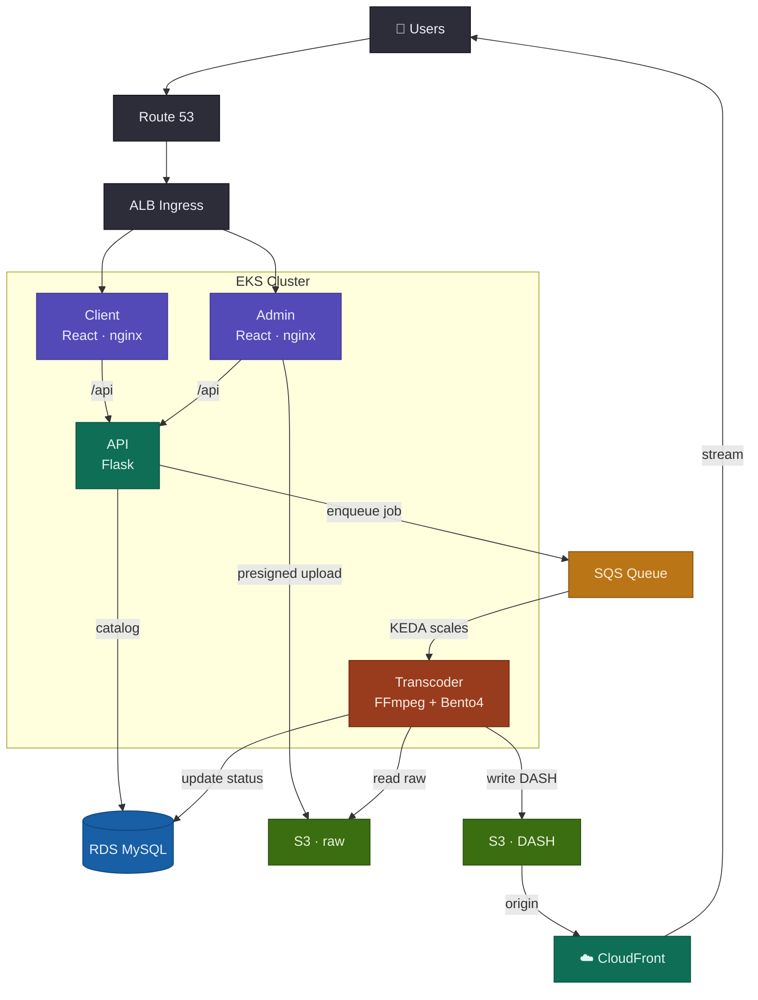

# ANIMUS — Cinematic Movie Streaming Platform

ANIMUS is a full-stack, **microservices** movie-streaming platform — a miniature
Netflix you can run end to end. A **React + TypeScript** website streams
adaptive-bitrate **MPEG-DASH** video through a custom **dash.js** player; an admin
dashboard ingests titles by importing **TMDB** metadata and uploading source files
straight to object storage; a **Flask + SQLAlchemy** API fronts a **MySQL** catalog;
and an **event-driven** **FFmpeg + Bento4** worker transcodes raw uploads into DASH
renditions. Every service is **Dockerized** and ships to **Kubernetes** with **KEDA**
queue-based autoscaling, targeting **AWS** (EKS, S3, SQS, RDS, CloudFront).

### Highlights

- 🎬 **Adaptive streaming** — MPEG-DASH at 1080p/720p/480p through a custom dash.js player with quality, audio, and subtitle tracks, plus trick-play thumbnails.
- 🧱 **Microservices monorepo** — independent **client**, **admin**, **API**, and **transcoder**; the only contract between them is the HTTP API's JSON shape.
- ⚙️ **Event-driven pipeline** — presigned **S3** uploads → **SQS** → **KEDA**-scaled **FFmpeg/Bento4** workers → DASH served from S3/CloudFront.
- ☸️ **Cloud-native** — Docker images, Kubernetes manifests, and KEDA autoscaling that run on **minikube + Floci** locally or **AWS EKS** in production.
- 🗂️ **TMDB-powered catalog** — admins add a title by pasting a TMDB link; metadata and artwork are fetched server-side.

## Services

| Service          | Role                             | Stack                                         | Dev URL               | Docs                               |
| ---------------- | -------------------------------- | --------------------------------------------- | --------------------- | ---------------------------------- |
| `apps/client`    | Public streaming website         | React, Vite, Tailwind, Framer Motion, dash.js | http://localhost:5173 | [README](apps/client/README.md)    |
| `apps/admin`     | Catalog dashboard + video ingest | React, Vite, Tailwind, Framer Motion          | http://localhost:5174 | [README](apps/admin/README.md)     |
| `apps/api`       | Catalog HTTP API                 | Python, Flask, SQLAlchemy, MySQL              | http://localhost:4000 | [README](apps/api/README.md)       |
| `apps/transcode` | Raw → DASH worker (SQS-driven)   | Python, FFmpeg, Bento4                        | — (worker)            | [README](apps/transcode/README.md) |

The four services share no code — only the HTTP API contract and a few backing
resources (MySQL, S3, SQS). Each has its own README with full setup details.

## How it works

The catalog and the video pipeline are **decoupled**: the API owns the MySQL
catalog, and ingestion runs asynchronously through a queue so a slow transcode never
blocks the apps.

| Step | What happens                                                                              |
| ---- | ----------------------------------------------------------------------------------------- |
| 1    | Admin imports TMDB metadata, then uploads the raw file straight to S3 via a presigned URL |
| 2    | Backend creates the movie row in MySQL (`status = created`)                               |
| 3    | On upload, the API enqueues a transcode job in SQS (`SendMessage`)                        |
| 4    | KEDA sees queue depth > 0 and scales up the transcoder worker(s)                          |
| 5    | Worker pulls the raw file from S3 and runs FFmpeg + Bento4                                |
| 6    | Worker uploads the DASH segments + manifest to the processed S3 bucket                    |
| 7    | Worker updates MySQL (`status = ready`, `manifest_url = …`)                               |
| 8    | Worker deletes the SQS message — job complete                                             |
| 9    | Client fetches the `ready` catalog from the API                                           |
| 10   | Player streams the `.mpd` + segments from the CDN (CloudFront in prod)                    |

A title moves through these statuses as it is ingested:

`created` -> `uploaded` -> `processing` -> `ready` (or `failed`)

- **created** — catalog row exists; raw file not uploaded yet (admin).
- **uploaded** — raw file is in S3; the API has enqueued a transcode job.
- **processing** — the transcode worker has picked up the job.
- **ready** — DASH stream published; visible to the public client.
- **failed** — transcode failed; left for retry/inspection.

Only `ready` titles are served to the public client; the admin sees every status.

## Architecture (AWS)

The platform runs on an **EKS** cluster inside a multi-AZ **VPC**. **Route 53**
resolves the public hostnames to an internet-facing **ALB** (provisioned by the AWS
Load Balancer Controller), which fans `animus.com` and `admin.animus.com` to the
client and admin pods. Those frontends are nginx and never touch the database — they
proxy `/api` to the internal **Flask API**, which owns the **RDS MySQL** catalog and
decouples ingest through an **SQS** queue.

The cluster runs two managed node groups: an untainted **`application`** group for the
client/admin/API pods, and a tainted **`worker`** group dedicated to the CPU-heavy
transcoder. **KEDA** watches SQS depth and scales the transcoder from zero — each pod
pulls the raw upload from the **S3** raw bucket, runs **FFmpeg + Bento4**, writes the
**DASH** output to the second bucket, and updates the catalog row directly. The admin
uploads source files straight to S3 with a **presigned PUT**, and **CloudFront** fronts
the DASH bucket for playback. API and worker pods authenticate to S3/SQS via **IRSA**
(`animus-sa` assumes an IAM role through the cluster's OIDC provider) — no static keys
live in the cluster.



## Repository layout

```text
.
├── apps/
│   ├── client/      # public streaming website   (see its README)
│   ├── admin/       # admin dashboard            (see its README)
│   ├── api/         # Flask catalog API          (see its README)
│   └── transcode/   # SQS-driven DASH transcoder (see its README)
├── kubernetes/     # K8s manifests for the local minikube + Floci deploy
├── helm/           # Helm chart for the AWS/EKS deploy (see Running on AWS)
├── scripts/        # cluster lifecycle, Floci provisioning, deploy
└── README.md       # you are here
```

## Quick start

The fastest way to run ANIMUS is to start each service directly — no root installer.
Bring up the **API first** (the frontends depend on it), then whichever UI you want;
full per-service setup lives in each app's README.

1. **API** — [apps/api](apps/api/README.md): create a venv, `pip install -r requirements.txt`,
   set the `MYSQL_*` values in `.env`, then `python run.py` (:4000).
2. **Client** — [apps/client](apps/client/README.md): `npm install` then `npm run dev` (:5173).
3. **Admin** — [apps/admin](apps/admin/README.md): `npm install` then `npm run dev` (:5174).
4. **Transcoder** — [apps/transcode](apps/transcode/README.md): a container that
   long-polls SQS against the shared S3 buckets and MySQL.

Each service reads its own configuration from a local, uncommitted `.env`, documented
in its README.

## Running on Kubernetes (minikube + Floci)

The whole stack also runs on a local 3-node **minikube** cluster against **Floci**, a
local AWS emulator that provides S3, SQS, and a real `mysql:8.0` "RDS" container — so
you exercise the same manifests, ingress, and KEDA autoscaling as production without
touching real AWS. Manifests live in `kubernetes/`; the helpers in `scripts/` wire it
together.

**Prerequisites:** `docker`, `minikube`, `kubectl`, `helm`, `socat`, the `aws` CLI,
and Floci.

### How the cluster reaches Floci

Floci runs on the host, so two pieces of glue (both wired into `scripts/cluster.sh`)
give in-cluster pods a stable name to reach it:

- **CoreDNS** maps `aws.animus.com` → the host gateway, so pods hit Floci's S3/SQS at
  `aws.animus.com:4566` (which Floci publishes on the host).
- **socat** bridges Floci's RDS — which only listens on the Docker bridge — onto the
  host gateway, so pods reach MySQL at `aws.animus.com:7001`.

### Steps

1. **Start Floci and provision its resources** (RDS, S3 buckets, SQS queue):

    ```bash
    floci start
    scripts/setup-local-aws.sh  # prints the RDS endpoint as "host port"
    ```

    If that endpoint isn't `172.17.0.2:7001`, set `FLOCI_RDS_ADDR` in
    `scripts/cluster.sh` to match.

2. **Create the cluster.** Starts a 3-node minikube (control-plane + `application` +
   `transcoder`), sizes/taints the transcoder node for FFmpeg, enables the ingress +
   metrics addons, patches CoreDNS, and starts the RDS socat bridge:

    ```bash
    scripts/cluster.sh create
    ```

3. **Map the hostnames** in `/etc/hosts` (use `minikube -p animus ip` for the
   cluster IP):

    ```text
    <minikube-ip>   animus.com admin.animus.com
    127.0.0.1       aws.animus.com
    ```

4. **Check `kubernetes/config.yaml`.** For Floci the AWS keys are `test`/`test`,
   `MYSQL_HOST: aws.animus.com` / `MYSQL_PORT: "7001"`, and `MYSQL_SSL_DISABLED:
"true"` (Floci's MySQL advertises TLS but can't complete the handshake).

5. **Build and push the service images** to your container registry, then deploy
   the stack:

    ```bash
    scripts/deploy-k8s-stack.sh
    ```

### Access

- Client → http://animus.com
- Admin → http://admin.animus.com

The API is internal; each frontend's nginx proxies `/api` to it. There's no
CloudFront locally, so the player streams DASH straight from Floci's S3.

### Teardown

```bash
scripts/cluster.sh stop     # stop the cluster + RDS bridge (state kept)
scripts/cluster.sh delete   # remove the cluster entirely
```

## Running on AWS (EKS)

For production, the [`helm/`](helm/) chart deploys the whole stack to **EKS** — the
client, admin, API, and the KEDA-autoscaled transcode worker, fronted by an **ALB**
ingress. Unlike the local path, this assumes the cluster and AWS resources already
exist; the script **only deploys the app with Helm**.

**Prerequisites** (provision once — see [`notes.md`](notes.md)):

- An **EKS** cluster with two node groups — `role=application` (untainted) and
  `role=worker` (tainted `dedicated=worker:NoSchedule`) for the transcoder.
- The **AWS Load Balancer Controller** (provides the `alb` IngressClass).
- An **IRSA role** with S3 + SQS access, bound to the `animus-sa` service account.
- **RDS MySQL**, the raw + DASH **S3** buckets, the transcode **SQS** queue, and a
  **CloudFront** distribution in front of the DASH bucket.

(KEDA is installed for you by the deploy script.)

**Configure.** Edit the values at the top of [`scripts/deploy-helm-stack.sh`](scripts/deploy-helm-stack.sh) — it passes them to the chart with `--set`. Fill them in locally and keep real secrets out of commits:

| Script variable     | Sets                      | Example                                                                   |
| ------------------- | ------------------------- | ------------------------------------------------------------------------- |
| `ROLE_ARN`          | `serviceAccount.roleArn`  | `arn:aws:iam::123456789012:role/animus-irsa`                              |
| `MYSQL_HOST`        | `config.mysql.host`       | `animus-mysql.abc123.ap-south-1.rds.amazonaws.com`                        |
| `MYSQL_PASSWORD`    | `secrets.mysqlPassword`   | your RDS password                                                         |
| `SQS_QUEUE_URL`     | `config.sqsQueueUrl`      | `https://sqs.ap-south-1.amazonaws.com/123456789012/animus-transcode-jobs` |
| `DASH_BASE_URL`     | `config.dashBaseUrl`      | `https://d111111abcdef8.cloudfront.net`                                   |
| `TMDB_API_KEY`      | `secrets.tmdbApiKey`      | optional — TMDB v3 API key (metadata import)                              |
| `TMDB_ACCESS_TOKEN` | `secrets.tmdbAccessToken` | optional — TMDB v4 token (preferred)                                      |

**Deploy.** Run the Helm deploy (it installs KEDA, then `helm upgrade --install`):

```bash
scripts/deploy-helm-stack.sh
```

Get the ALB address and point your DNS (`animus.com`, `admin.animus.com`) at it:

```bash
kubectl get ingress animus -o jsonpath='{.status.loadBalancer.ingress[0].hostname}'
```

The API stays internal; each frontend's nginx proxies `/api` to it, and the player
streams DASH from CloudFront.

## Conventions

- **Independent apps.** No shared package; the contract between services is the
  API's JSON shape. Each frontend defines its own TypeScript models under
  `src/types` and is kept in sync with the API by hand.
- **Response envelope.** Every API response is an `ApiResponse<T>`:
  `{ "success": true, "data": … }` or `{ "success": false, "error": "…" }`.
- **Admin visibility.** The admin app sends `X-Admin-Request: true` so the API
  returns titles in any status; the public client only ever sees `ready`.
