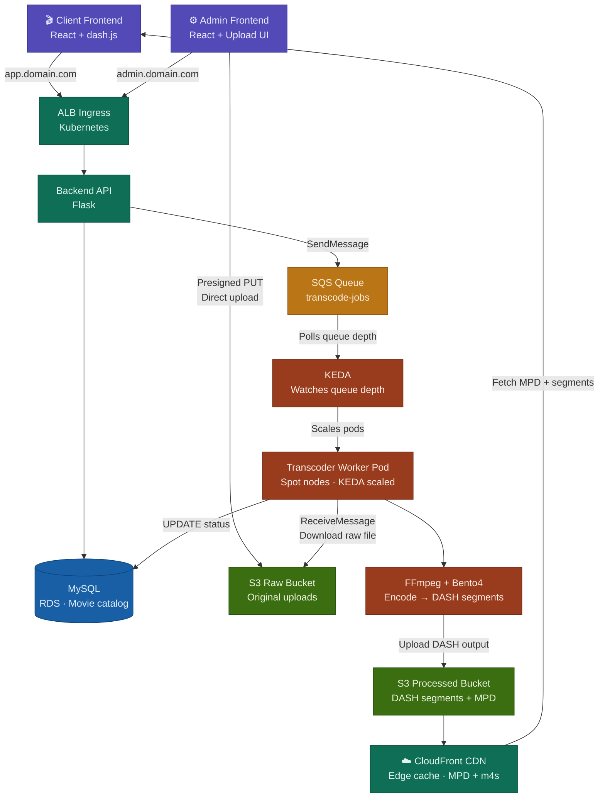

# Animus - Movie Streaming Platform

ANIMUS is a cinematic movie-streaming platform: a public website to browse and
watch titles, an admin dashboard to manage the catalog and ingest video, a Flask
API in front of a MySQL catalog, and a containerized worker that transcodes raw
uploads into adaptive **DASH** streams.

The pieces are **independent services** — they share no code, only the HTTP API
contract and a few AWS resources (MySQL, S3, SQS). Each service has its own
README with the working details, requirements, and setup; this document is the
map.

## Services

| Service          | Role                             | Stack                                         | Dev URL               | Docs                               |
| ---------------- | -------------------------------- | --------------------------------------------- | --------------------- | ---------------------------------- |
| `apps/client`    | Public streaming website         | React, Vite, Tailwind, Framer Motion, dash.js | http://localhost:5173 | [README](apps/client/README.md)    |
| `apps/admin`     | Catalog dashboard + video ingest | React, Vite, Tailwind, Framer Motion          | http://localhost:5174 | [README](apps/admin/README.md)     |
| `apps/api`       | Catalog HTTP API                 | Python, Flask, SQLAlchemy, MySQL              | http://localhost:4000 | [README](apps/api/README.md)       |
| `apps/transcode` | Raw → DASH worker (SQS-driven)   | Python, FFmpeg, Bento4                        | — (worker)            | [README](apps/transcode/README.md) |

## Architecture

The platform runs on AWS. An **ALB ingress** fronts an **EKS** cluster where the
client, admin, and Flask API each run as their own Kubernetes deployment. The
frontends never touch the database — they go through the API, which persists the
catalog to **MySQL (RDS)** and decouples video ingest through an **SQS** queue.
**KEDA** scales the transcode worker pods off that queue: they read the raw
upload from S3, write the packaged **DASH** output to a second S3 bucket, and
update the catalog row directly. **CloudFront** fronts the DASH bucket for
playback.



---

## Flow Summary

| Step | What happens                                                     |
| ---- | ---------------------------------------------------------------- |
| 1    | Admin uploads raw video directly to S3 via presigned URL         |
| 2    | Backend creates movie row in MySQL (`status = created`)          |
| 3    | Backend API sends a transcode job to SQS (`SendMessage`)         |
| 4    | KEDA detects queue depth > 0 → scales up transcoder worker pods  |
| 5    | Worker downloads raw file from S3, runs FFmpeg + Bento4          |
| 6    | Worker uploads DASH segments + manifest to S3 processed bucket   |
| 7    | Worker updates MySQL (`status = ready`, `manifest_url = ...`)    |
| 8    | Worker deletes SQS message — job complete                        |
| 9    | Client fetches movie catalog from Backend API                    |
| 10   | Client player fetches `.mpd` + segments directly from CloudFront |

A title moves through these statuses as it is ingested:

`created` -> `uploaded` -> `processing` -> `ready` (or `failed`)

- **created** — catalog row exists; raw file not uploaded yet (admin).
- **uploaded** — raw file is in S3; the API has enqueued a transcode job.
- **processing** — the transcode worker has picked up the job.
- **ready** — DASH stream published; visible to the public client.
- **failed** — transcode failed; left for retry/inspection.

Only `ready` titles are served to the public client; the admin sees every status.

## Repository layout

```text
.
├── apps/
│   ├── client/      # public streaming website   (see its README)
│   ├── admin/       # admin dashboard            (see its README)
│   ├── api/         # Flask catalog API          (see its README)
│   └── transcode/   # SQS-driven DASH transcoder (see its README)
├── notes.md        # AWS provisioning notes (RDS, S3, SQS, EKS, CloudFront)
└── README.md       # you are here
```

## Getting started

There is no root installer or orchestrator — each service runs on its own. Start
the **API first** (the frontends depend on it), then whichever UI you want. Full
setup and configuration live in each service's README:

1. **API** — [apps/api](apps/api/README.md): create a venv, install
   `requirements.txt`, configure MySQL in `.env`, then `python run.py` (:4000).
2. **Client** — [apps/client](apps/client/README.md): `npm install` then
   `npm run dev` (:5173).
3. **Admin** — [apps/admin](apps/admin/README.md): `npm install` then
   `npm run dev` (:5174).
4. **Transcode worker** — [apps/transcode](apps/transcode/README.md): runs as a
   container long-polling SQS, against the shared S3 buckets and MySQL.

Each service reads its own configuration from a local, uncommitted `.env`; the
required variables are documented in that service's README.

## Conventions

- **Independent apps.** No shared package; the contract between services is the
  API's JSON shape. Each frontend defines its own TypeScript models under
  `src/types` and is kept in sync with the API by hand.
- **Response envelope.** Every API response is an `ApiResponse<T>`:
  `{ "success": true, "data": … }` or `{ "success": false, "error": "…" }`.
- **Admin visibility.** The admin app sends `X-Admin-Request: true` so the API
  returns titles in any status; the public client only ever sees `ready`.
